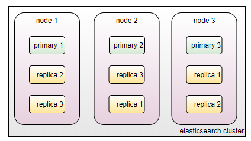

# Table of Contents
* [Facts & Assumptions](#facts-assumptions)
* [Requirements](#requirements)
* [Elasticsearch](#elasticsearch)
    * [Concepts](#concepts)
    * [Nodes](#data-replication-and-balancing)
        * [Node Types](#node-types)
        * [Node Resource Consumption](#node-resource-consumption)
    * [Clustering](#clustering)
        * [Resilience in a three node cluster](#resilience-in-a-three-node-cluster)
* [Resources](#resources)
    * [Webinars](#webinars)
    * [Documentation](#documentation)

# Facts & Assumptions
* Elastic Stack is licensed per:
    * the capabilities that will be used, see [Elastic Stack subscriptions](https://www.elastic.co/subscriptions)
        * It is possible to deploy a complete Elastic Stack if the required features belong to the ‘Basic – Free and Open’ category.
        * One aspect to keep in mind for the ‘Free & Basic’ subscriptions is the support.
    * **Elasticsearch node** and licenses will be counted precisely by the number of hosts on which Elasticsearch is deployed, some of the details to keep in mind are:
        * The calculation of licenses does not include nodes with Ingest, Client / Coordinating roles.
        * To calculate the number of nodes is important to note that this calculation is directly influenced by the volume of incoming traffic and data storage requirements.

* Our current Gold license:
    * Has a limit of 64 GB of RAM per Data or Master Elasticsearch node.
    * Does not provide Machine Learning capability but this is not a consideration at the moment.

* High availability for Kibana and Logstash is not critical.

**Based on the above information, we can deploy as many Logstash and Kibana nodes as needed.** Therefore, we will focus on Elasticsearch deployments based on the recommendations given by Elastic.

# Requirements
* Additional (free tier) ELK cluster to **monitor** the primary cluster.
    * For primary cluster, load balance Kibana requests to all Elasticsearch nodes in the cluster.

# Elasticsearch
Elasticsearch is a distributed document store and search engine. Instead of storing information as rows of columnar data, Elasticsearch stores complex data structures that have been serialized as JSON documents. When you have multiple Elasticsearch nodes in a cluster, stored documents are distributed across the cluster and can be accessed immediately from any node.

## Concepts
* **Fields** are the smallest individual unit of data, key*value pair, in a Elasticsearch document.
    * **In the world of relational databases, a field can be compared to a column in table**.
    * Have a defined datatype and contains a single piece of data.
        * **core datatypes**: strings, numbers, dates, Booleans.
        * **complex datatypes**: object and nested
        * **geo datatypes**: get\_point and geo\_shape.
        * **specialized datatypes**: token count, join, rank feature, dense vector, flattened, etc

* **Documents** are JSON objects that are stored within an Elasticsearch index and are considered the base unit of storage.
    * **In the world of relational databases, documents can be compared to a row in table**
    * There is no limit to how many documents you can store in a particular index
    * Data in documents is defined with fields comprised of keys and values.

* **Mapping** is the process of defining how a document, and the fields it contains, are stored and indexed.
    * **In the world on relational databases, mapping can be compared to a schema**
    * A mapping definition also includes metadata fields, like the \_source field, which customize how a document’s associated metadata is handled.
    * **Mapping Types:**
        * **Dynamic mapping**, Elasticsearch adds new fields automatically, just by indexing a document
            * Fields can be added to the top*level mapping, and to inner object and nested fields.

        * **Explicit mapping** allows you to precisely choose how to define the mapping definition.

* **Index** (Indices) are the largest unit of data in Elasticsearch, are logical partitions of documents and each document is a collection of fields, which are the key*value pairs that contain your data.
    * **In the work of relational databases, indices can be compared to a database.**
    * There can be as many indices as needed, each will hold documents that are unique to each index.
    * Indices are identified by lowercase names that refer to actions that are performed actions (such as searching and deleting) on the documents that are inside each index.
    * Each index is made up of one or more shards.

* **Shards** are a Lucene\[1\] index that stores and processes some or all data for an index.
    * They are the building blocks of Elasticsearch and what facilitate its scalability.
        * Elasticsearch automatically creates and manages these Lucene instances

    * Can be distributed across multiple nodes in a cluster to achieve data redundancy and load sharing goals.\[2\]
    * There are two types of shards:
        * **Primary**: Lucene instance containing some or all data for an index. When you index a document, Elasticsearch adds the document to primary shards before replica shards.
        * **Replica**: Copy of a primary shard. **Replica shards can improve search performance and resiliency by distributing data across multiple nodes**.
            * A replica shard is never allocated on the same node where the related primary is.

* **Segment** is a Lucene segment, shards are composed of Lucene segments, that immutably stores a portion of a Lucene index.\[3\]

## More about Sharding & Replicas

### Sharding

Is a way of dividing an index’s data into smaller parts which are called shards.

Prior Elasticsearch 7 there were 5 shards per index are created by default, starting with Elasticsearch 7 only one shard per index is created by default.

An index’s shards will not necessarily be distributed across multiple physical or virtual machines, as this depends on the number of nodes in your cluster.

For cluster with more than one node, sharding enables:
  * Distribute data across multiple nodes within a cluster
  * Increases performance in cases where shards are distributed on multiple nodes, because search queries can then be parallelized, which better utilizes the hardware resources that your nodes have available to them.

Best Practices:
  * Do not exceed 20 shards per GB of JVM Heap\[4\]
  * Do not exceed (up to) 50 GB per shard (index life cycle management)

### Replicas
Replicas are Elasticsearch fail*safe mechanisms, they provide redundant copies of the data and increase capacity to serve read requests like searching or retrieving a document.

A single node cluster is not resilient. If the node fails, the cluster will stop working. Because there are no replicas in a one*node cluster, the data cannot be stored redundantly.

For a cluster with more than one node, the following is true for replicas:
  * Replicas are not placed on the same node as the original shards from which they were replicated
  * Replicas can help to increase search throughput at the expense of indexing throughput and vice versa.
      * *We will optimize for search therefore we don’t anticipate indexing being an issue.*

  * The number of replicas can be defined per index when the index is created
  * The number of replica shards can be changed at any time, without interrupting indexing or query operations.

### Storage considerations
  * Shards have a ***direct impact on storage requirements*** for any Elasticsearch cluster (specifically replica shards).
  * The number of replicas can be reduced in order to have more disk space available to store data, however that is in exchange of data redundancy.

## Data replication and balancing
Elasticsearch knows how to balance multi*node clusters to provide scale and high availability by:

1.  Distributing the documents in an index across multiple shards and
1.  Distributing shards (primary and replicas) across multiple nodes

Elasticsearch can ensure redundancy, which both protects against hardware failures and increases query capacity **as nodes are added to a cluster**. As the cluster grows (or shrinks), Elasticsearch automatically migrates shards to rebalance the cluster.

> **The more nodes, the merrier**

When a node leaves the cluster for whatever reason, intentional or otherwise, the master reacts by:
  * Promoting a replica shard to primary to replace any primaries that were on the node.
  * Allocating replica shards to replace the missing replicas (assuming there are enough nodes).
  * Rebalancing shards evenly across the remaining nodes.

These actions are intended to protect the cluster against data loss by ensuring that every shard is fully replicated as soon as possible.

## Nodes
A Java process that runs the Elasticsearch software. Usually there is a computer (physical or virtual) but with containerization the whole stack can be loaded as java process containers.

### Node Types
There are more node types, please refer to the official documentation, here we only cover those that make sense from our usage perspective.

  * Master Nodes
      * Responsible for lightweight cluster wide actions such as creating or deleting an index, tracking which nodes are part of the cluster, and deciding which shards to allocate to which nodes.
      * **Elastic recommends a minimum of 3 master nodes in a multinode cluster**
      * Only one is active at any given time
      * Dedicated master nodes are recommended

  * Data nodes:
      * **Hold indexed data and perform data related operations**

  * Ingest Nodes:
      * Use ingest pipelines to transform and enrich before indexing

  * Coordinating Nodes:
      * Route requests
      * Handle search reduce phase
      * Distribute bulk indexing
      * **All nodes functions as coordinating nodes**

### Node Resource Consumption

## Clustering

### Resilience in a three* node cluster
The following recommendation are given by Elastic specifically for a three node Elasticsearch cluster:
* All they are data nodes
    * **Default behavior**

* Each node must be configured to be ‘master* eligible’
    * Any two of them can hold a master election without needing to communicate with the third node (Split Brain)
    * **Default behavior**

* Avoid sending client requests to just one of your nodes.
    * Balance client requests across all three nodes
        * Specify the address of multiple nodes when configuring clients
        * Use a resilient load balancer.

# Resources
## Webinars
* [Sizing and capacity planing](https://www.elastic.co/webinars/elasticsearch*-sizing*-and*-capacity-*planning)
* [Quantitative cluster sizing](https://www.elastic.co/elasticon/conf/2016/sf/quantitative*-cluster*-sizing)

## Documentation
* [Glossary](https://www.elastic.co/guide/en/elasticsearch/reference/current/glossary.html)
* [Document Indices](https://www.elastic.co/guide/en/elasticsearch/reference/7.12/documents-*indices.html)
* [Mapping](https://www.elastic.co/guide/en/elasticsearch/reference/7.12/mapping.html)
* [Elasticsearch concepts](https://logz.io/blog/10-elasticsearch-concepts/)
* [Elastisearch 7.X - Breaking Changes](https://www.elastic.co/guide/en/elasticsearch/reference/current/breaking-changes-7.0.html#_index_creation_no_longer_defaults_to_five_shards)
* [Scalability](https://www.elastic.co/guide/en/elasticsearch/reference/current/scalability.html)
* [High availability in small clusters](https://www.elastic.co/guide/en/elasticsearch/reference/current/high-availability-cluster-small-clusters.html)
* [Nodes](https://www.elastic.co/guide/en/elasticsearch/reference/current/modules-node.html)
* [Delayed allocation](https://www.elastic.co/guide/en/elasticsearch/reference/current/delayed-allocation.html)

---***

1.  Apache Lucene is a Java open-source library that performs full-text search
2.  See ‘More about Sharding & Replicas’ for details
3.  Generally speaking, it is low level we should not care about since it is managed automatically by Elasticsearch.
4.  Heap memory is the run time data area from which the memory for all java class instances and arrays is allocated
