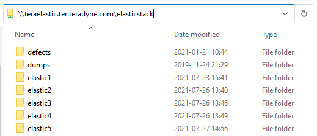
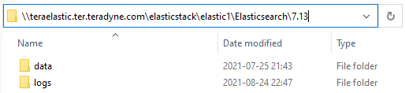
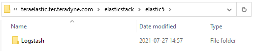

# Table of Contents
* [Considerations](#considerations)
* [Filer storage setup](#filer-storage-setup)
* [Elasticsearch](#elasticsearch)
    * [Repository and installation](#repository-and-installation)
    * [Mount filer storage](#mount-filer-storage)
    * [Configuration](#configuration)
    * [Elasticsearch keystore](#keystore)
    * [Service Configuration](#service-configuration)
    * [Verification](#verification)
    * [License activation](#license-activation)
    * [CLI](#cli)
    * [Securing Cluster's nodes communication](#secure-clusters-nodes-communication)
    * [Stack Monitoring ](Metricbeat)(#stack-monitoring-metricbeat)
* [Metricbeat Configuration](#configuration)
* [Kibana](#_Toc81027677)
    * [Repository & Installation](#repository-installation)
    * [Kibana Configuration](#configuration)
    * [Setup Plugins](#plugins)
    * [Start Service & Verification](#_Toc81027681)
* [Logstash](#logstash)
    * [Repository & Installation](#repository-installation)
    * [Mount Filer Storage](#mount-filer-storage)
    * [Logstash Configuration](#logstash-configuration)
    * [Start Service & Verification](#start-service)
* [Install Filebeat](#filebeat)
    * [Setup Filebeat Cleaner](#setup-filebeat-cleaner)

** Are these below really needed???**
* [Install the Test Infrastructure](#_Toc81027689)
* [Securing Elastic Stack with X-pack](#securing-elastic-stack-with-x-pack)
* [Installing X-Pack](#_Toc81027691)
* [Configuring X-pack](#configuring-x-pack)
* [Configuring Group Roles and Mapping](#configuring-group-roles-and-mapping)

# Considerations
* java is not required to be installed, since Elastic apps bundles its own java binary
* The installation method uses Elastic repositories which assumes Internet access
* X-pack is configured alongside with Elasticsearch, Kibana & Logstash
* Password are stored in each application keystore
* Configuration files are in stored in [GitHub repository]

# Filer storage setup

One directory per server was created in the filer, `\\teraelastic.ter.teradyne.com\elasticstack\` , as you can see in the picture below.



The directory structure for elasticsearch servers is



And for elastic5 (Logstash & Filebeats)



Configure permission for each directory created as follows:
* Right click to each folder
* Go to the security tab
    * Click Edit
    * Click Add
    * Add `srv-elastic`

# Elasticsearch
## Repository and installation

1. Import the repository key\
`rpm --import https://artifacts.elastic.co/GPG-KEY-elasticsearch`

1.  Create the repository file, `/etc/yum.repos.d/elasticsearch.repo`, with the following content:\
```txt
[elasticsearch]
name=Elasticsearch repository for 7.x packages
baseurl=https://artifacts.elastic.co/packages/7.x/yum
gpgcheck=1
gpgkey=https://artifacts.elastic.co/GPG-KEY-elasticsearch
enabled=0
autorefresh=1
type=rpm-md
```

1. Install Elasticsearch\
`yum install -y --enablerepo=elasticsearch elasticsearch`

## Mount filer storage

Before Elasticsearch configuration, make sure filer storage is available as persistent storage in the system:

1. Create the mountpoint **teraelastic** in `/mnt`\
`mkdir /mnt/teraelastic`

1. Edit `/etc/fstab` and add the following:\
`//teraelastic.ter.teradyne.com/elasticstack/elastic# /mnt/teraelastic/ cifs credentials=/root/.teraelastic,rw,uid=elasticsearch,gid=elasticsearch 0 0`

    a. Make sure to use the appropriate number, 1 to 4, for **elastic#** based on [Configure Filer Storage](#configure-filer-storage) section and the server that is being configured.

1. Create the credentials file\
    a. Create the credentials file
    `vim /root/.teraelastic`

    b. Add the following content
    ```txt
    username=srv-elastic
    password=<service_account_password>
    ```
    c. Save and close the file

    d. Change the file permission to only allow *read & write* to root\
    `chmod 600 /root/.teraelastic`

1.  Mount the filer storage\
`mount -a`
    a.  If above command throws an error, check previous steps for errors.

## Configuration

1.  Go to `/etc/elasticsearch/`
1.  Get the configuration file from the [repository]()
    a.  From the main page in the repository go to `elasticsearch/config/`
    b.  There will be a directory per each node in the cluster
    c.  Copy the configuration file appropriate for the node that is being configured

### Keystore

#### System user passwords
