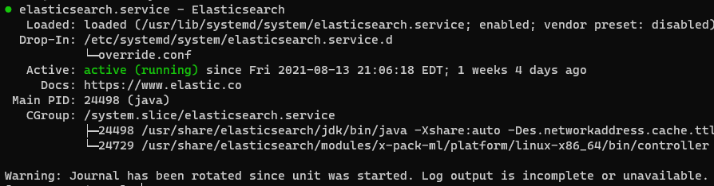
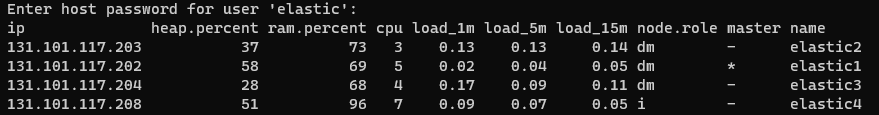
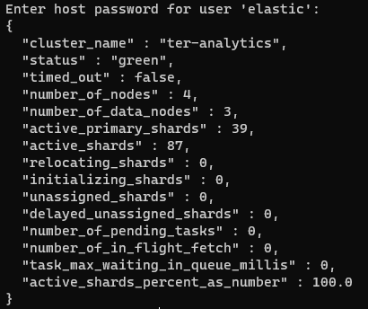

# Elasticsearch Deployment
* [Repository and installation](#repository-and-installation)
* [Mount filer storage](#mount-filer-storage)
* [Configuration](#configuration)
* [Keystore](#keystore)
    * [System user passwords](#system-user-passwords)
    * [Secure nodes communication](#secure-nodes-communication)
    * [LDAP](#ldap)
* [System service](#system-service)
* [Verification](#verification)
* [License activation](#license-activation)
    * [CLI](#cli)
* [Secure cluster's nodes communication](#secure-clusters-nodes-communication)

---

# Repository and installation

1. Import the repository key\
`rpm --import https://artifacts.elastic.co/GPG-KEY-elasticsearch`

1.  Create the repository file, `/etc/yum.repos.d/elasticsearch.repo`, with the following content:\
```txt
[elasticsearch]
name=Elasticsearch repository for 7.x packages
baseurl=https://artifacts.elastic.co/packages/7.x/yum
gpgcheck=1
gpgkey=https://artifacts.elastic.co/GPG-KEY-elasticsearch
enabled=0
autorefresh=1
type=rpm-md
```

1. Install Elasticsearch\
`yum install -y --enablerepo=elasticsearch elasticsearch`

# Mount filer storage

Before Elasticsearch configuration, make sure filer storage is available as persistent storage in the system:

1. Create the mountpoint **teraelastic** in `/mnt`\
`mkdir /mnt/teraelastic`

1. Edit `/etc/fstab` and add the following:\
`//teraelastic.ter.teradyne.com/elasticstack/elastic# /mnt/teraelastic/ cifs credentials=/root/.teraelastic,rw,uid=elasticsearch,gid=elasticsearch 0 0`

    a. Make sure to use the appropriate number, 1 to 4, for **elastic#** based on [Configure Filer Storage](#configure-filer-storage) section and the server that is being configured.

1. Create the credentials file\
    a. Create the credentials file
    `vim /root/.teraelastic`

    b. Add the following content
    ```txt
    username=srv-elastic
    password=<service_account_password>
    ```
    c. Save and close the file

    d. Change the file permission to only allow *read & write* to root\
    `chmod 600 /root/.teraelastic`

1.  Mount the filer storage\
`mount -a`

    a.  If above command throws an error, check previous steps for a typo.

# Configuration

1.  Get the configuration file from the [repository]()

    a.  From the main page in the repository go to `elasticsearch/config/`

    b.  There will be a directory per each node in the cluster

1.  Copy the appropriate configuration file for the node that is being configured in `/etc/elasticsearch/`

# Keystore

In order to not have password in plain text, the keystore is being used to store the passwords.

## System user passwords

* The following command is intended for use only during the initial configuration of the Elasticsearch security features
* Interactive mode is used, and the password is `changeme` **for all system users**

`/usr/share/elasticsearch/bin/elasticsearch-setup-passwords interactive`

## Secure nodes communication

Self-signed certificates are used, this means:
* The creation of a single certificate that will be used for
* Certificate level verification for each of the nodes
* Password is `changeme`

1. Go to /etc/elasticsearch\
`cd /etc/elasticsearch`

1. Create a certs directory\
`mkdir certs`

1. Change certificate ownership\
`chown root:elasticsearch certs/`

1. Create the self-signed certificate\
`/usr/share/elasticsearch/bin/elasticsearch-certutil cert --name teraelastic-certificates.p12 --out /etc/elasticsearch/certs/`

    a.  A password will be asked, if a password is set then it will need to be added to Elasticsearch key store.

    b.  Create a new keystore (if already exists, cancel the operation)\
    `/usr/share/elasticsearch/bin/elasticsearch-keystore create -p`

    c.  Add the certificates password in the keystore\
    `/usr/share/elasticsearch/bin/elasticsearch-keystore add xpack.security.transport.ssl.keystore.secure_password`
    `/usr/share/elasticsearch/bin/elasticsearch-keystore add xpack.security.transport.ssl.truststore.secure_password`

1. Change certificate permissions
`chmod -R 640 certs/`

1. Copy the created certificate to the other nodes, make sure to follow all steps except step #3.

    a.  Step #3 is not needed since it will create another certificate

## LDAP

Use the following command to store the password in the keystore:

`/usr/share/elasticsearch/bin/elasticsearch-keystore add xpack.security.authc.realms.ldap.ldap.secure_bind_password`

The password must be submitted twice, and you won't see the password typed.

# System Service

The option, `bootstrap.memory_lock: true`, is required when a system will be on production.

> The default Elasticsearch systemd unit file is missing the limits configuration to grant the resource access required, therefore an override[^1] configuration must be created for Elasticsearch to access the resources needed.

1.  Edit Elasticsearch's systemd unit file\
`systemctl edit elasticsearch.service`

1.  Add the following to the file
```txt
[Service]
LimitMEMLOCK=infinity
LimitNPROC=4096
LimitNOFILE=65536
```

1.  Save and close the file

1.  Enable & start Elasticsearch service\
`systemctl enable --now elasticsearch`

1.  Check service status\
`systemctl status elasticsearch`

If successful, you will see something like this



If not, check [Elasticsearch configuration]() & [Service configuration]() for typos.

# Verification

Once the service is running in all nodes, check the cluster status:

`curl http://nodeIP:9200/_cat/nodes?v -u elastic`



`curl http://nodeIP:9200/_cluster/health?pretty -u elastic`



# License Activation

Requirements:

* Download License file
* License file must be in the node that you want to use for the license activation

## CLI

This step can be done in any Elasticsearch node; in this case, elastic4 node was used: and the command must be submitted twice:

1.  First license command:\
`curl -XPUT -u elastic 'http://131.101.117.208:9200/_license' -H "Content-Type: application/json" -d \@teradyne-non_production-718f278f-e7a4-4887-b1be-efcea8b23a32-v5.json`

    a.  Enter host password for user `elastic`

    b.  And the response will look like the following:
    ```json
    {"acknowledged":false,"license_status":"valid","acknowledge":{"message":"This license update requires acknowledgement. To acknowledge the license, please read the following messages and update the license again, this time with the "acknowledge=true" parameter:","security":["Field and document level access control will be disabled.","Custom realms will be ignored.","A custom authorization engine will be ignored."]}}
    ```

1.  Now, modify the command to add the acknowledgement required:\
`curl -XPUT -u elastic 'http://131.101.117.208:9200/_license?acknowledge=true' -H "Content-Type: application/json" -d @teradyne-non_production-718f278f-e7a4-4887-b1be-efcea8b23a32-v5.json`

    a.  Enter host password for user `elastic`

    b.  And the response will look like the following:
    `{"acknowledged":true,"license_status":"valid"}`

1.  License is now activated

---
footnotes

[^1]: The override guarantees that when Elasticsearch gets updated, this configuration won't be lost.
