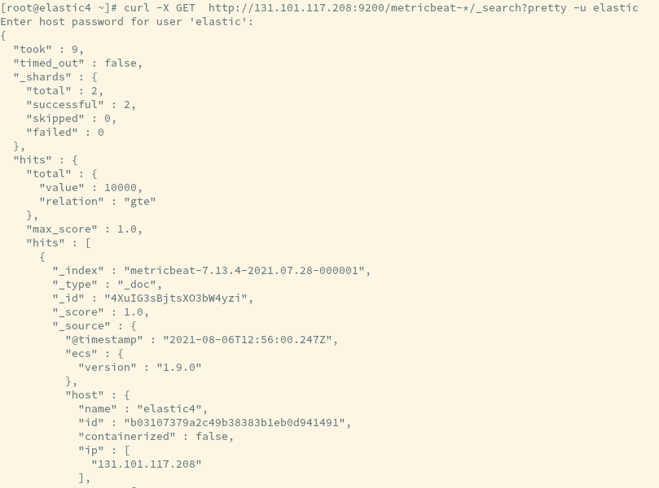

# Metricbeat Deployment
* [Repository and installation](#repository-and-installation)
* [Configuration](#configuration)
* [Keystore](#keystore)
* [System service](#system-service)
* [Verification](#verification)

---

[source](https://www.elastic.co/guide/en/elasticsearch/reference/current/configuring-metricbeat.html)

> Legacy monitoring will be not supported from Elasticsearch 8 release, therefore in an effort to prepare for the future the cluster is being monitored by Metricbeat.

A single Metricbeat instance, elastic4, configured with `scope: cluster` configured to point to an endpoint which directs requests to the master-eligible nodes in the cluster.

# Repository and installation

1. Import repository key (if not already imported)\
`rpm --import <https://packages.elastic.co/GPG-KEY-elasticsearch>`

1. Create the repository file, /etc/yum.repos.d/elastic-packages.repo, with the following content:
```txt
[elastic-7.x]
name=Elastic repository for 7.x packages
baseurl=https://artifacts.elastic.co/packages/7.x/yum
gpgcheck=1
gpgkey=https://artifacts.elastic.co/GPG-KEY-elasticsearch
enabled=1
autorefresh=1
type=rpm-md
```

1. Install Metricbeat\
`yum install -y metricbeat`

# Configuration

1.  Get the configuration file from the [repository]()

    a.  From the main page in the repository go to `metricbeat/config/`

    b.  There will be a directory per each host that runs Metricbeat

1.  Copy the appropriate configuration in `/etc/metricbeat`

1. Enable Elasticsearch module\
`metricbeat modules enable elasticsearch-xpack`

1. Enable Kibana module\
`metricbeat modules enable kibana-xpack`

# Keystore

1. Create the keystore\
`metricbeat keystore create`

1. Add elasticsearch system password to the keystore\
`metricbeat keystore add ES_PWD`

# System service

1. Enable & start Metricbeat service\
`systemctl enable --now metricbeat.service`

# Verification

`curl -X GET node_IP:9200/metricbeat-*/_search?pretty`



