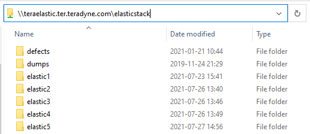
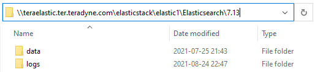
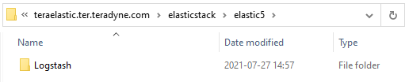

# Landing page

[Elastisearch 101](technical_guide.md)

# Elastic Stack deployment

## Considerations
* java is not required to be installed, since Elastic apps bundles its own java binary
* The installation method uses Elastic repositories which assumes Internet access
* X-pack is configured alongside with Elasticsearch, Kibana & Logstash
* Password are stored in each application keystore
* Configuration files are in stored in [GitHub repository]

## Filer storage setup

One directory per server was created in the filer, `\\teraelastic.ter.teradyne.com\elasticstack\` , as you can see in the picture below.

The directory structure for elasticsearch servers is

And for elastic5 (Logstash & Filebeats)

Configure permission for each directory created as follows:
* Right click to each folder
* Go to the security tab
    * Click Edit
    * Click Add
    * Add `srv-elastic`

Stack Applications:
* [Elasticsearch](deployment/elasticsearch.md)
* [Metricbeat](deployment/metricbeat.md)

---

|Hostname|CPU|RAM|App Deployed|Elasticsearch Node Role|
| --- | --- | --- | --- | --- |
| elastic1 | 4 | 32 GB | Elasticsearch | master node |
| elastic4 | 4 | 32 GB | * Elasticsearch \n * Kibana | coordinating node |
| elastic4 | 4 | 32 GB | <ul><li>Elasticsearch</li><li>Kibana</li></ul> | coordinating node |
| elastic4 | 4 | 32 GB | Elasticsearch Kibana | coordinating node NA |
| elastic5 | 2 | 4 GB | Logstash | NA |
